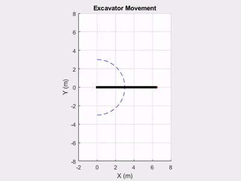
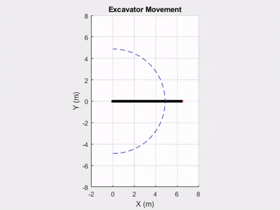
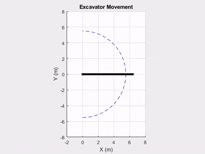
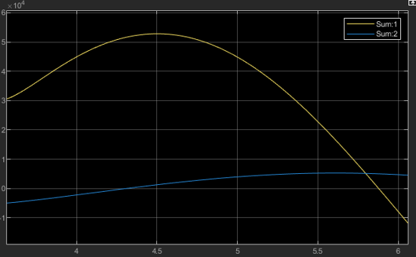
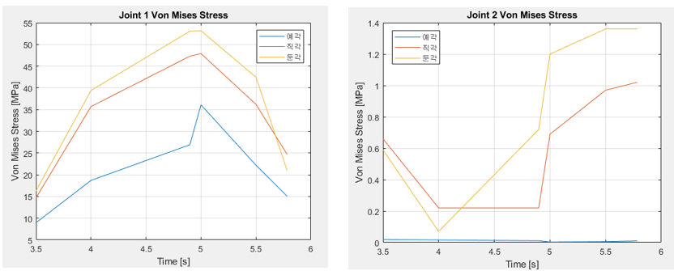

# Excavator Boom & Arm Analysis Project

본 프로젝트는 두산 DX140W-5 굴삭기의 붐(Boom)과 암(Arm)을 2링크 매니퓰레이터로 단순화하여, **MATLAB**, **Simulink**, **COMSOL Multiphysics**를 활용해 동역학 해석, 제어기 설계, 그리고 구조적 안전성 평가까지 통합적으로 수행한 엔지니어링 시뮬레이션입니다.

---

## 프로젝트 개요

- **참고 모델:** 두산 DX140W-5 굴삭기  
  - 붐(Boom): 4.4m, 1500kg  
  - 암(Arm): 2.2m, 700kg

- **주요 목표:**  
  1. 굴삭기 붐과 암을 2링크 로봇팔로 단순화하여 기구학/동역학 해석  
  2. MATLAB/Simulink로 경로 추종 및 PD 제어 성능 평가  
  3. 각 관절의 토크/각도 데이터를 바탕으로 COMSOL에서 구조 해석 및 안전성 평가

---

## 시뮬레이션 및 해석 흐름

1. **MATLAB/Simulink**  
   - 굴삭기 링크의 순기구학/역기구학, 동역학 방정식(라그랑주), PD 제어기 설계  
   - 경로 추종, 진동 억제, 각 관절의 토크 및 각도 산출  
   - 실시간 그래프 및 애니메이션 구현

2. **COMSOL Multiphysics**  
   - CATIA로 모델링한 붐과 암의 3D 구조를 COMSOL로 임포트  
   - MATLAB/Simulink에서 산출한 관절 토크 및 각도를 시간별 하중/경계조건으로 적용  
   - 유한요소해석(FEM)으로 Joint 부위의 Von Mises Stress(응력) 분포 및 최대값 평가

---

## 결과: 예각, 직각, 둔각에 따른 MATLAB/Simulink 및 COMSOL 해석 비교

### MATLAB/Simulink 시뮬레이션 GIF (붐과 암의 사이각별 움직임)

| 사이각 상태 | 설명          | GIF 파일명 (main branch) |
|-------------|---------------|--------------------------|
| 예각 (3m)   | 모멘트 암 짧음 |           |
| 직각 (90도) | 모멘트 암 중간 |    |
| 둔각 (5.5m) | 모멘트 암 최대 |         |

---

### Simulink Torque 그래프

---

### COMSOL Von Mises Stress 그래프

---

## 결론 및 시사점

- **토크 증가 → 응력 증가:** 관절 각이 둔각이 될수록(모멘트 암이 길어질수록) 최대 Von Mises Stress가 커짐  
- **안전성 평가:** Joint 부위에 응력이 집중되므로, 구조적 취약점 분석 및 설계 개선에 활용 가능  
- **MATLAB/Simulink와 COMSOL 연계:** 실제 제원 기반의 동역학-제어-구조해석 통합 시뮬레이션 가능

---

## 참고자료

- [두산 DX140W-5 제원](https://blog.naver.com/PostView.nhn?blogId=cetec16&logNo=221088986488)  
- [참고한 GitHub: Two-Link-Robot-Control](https://github.com/AminPmi/Two-Link-Robot-Control)
